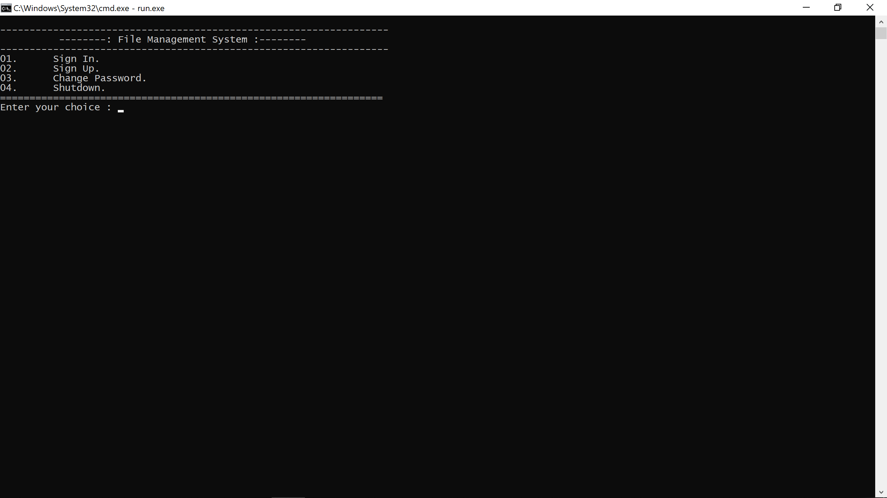
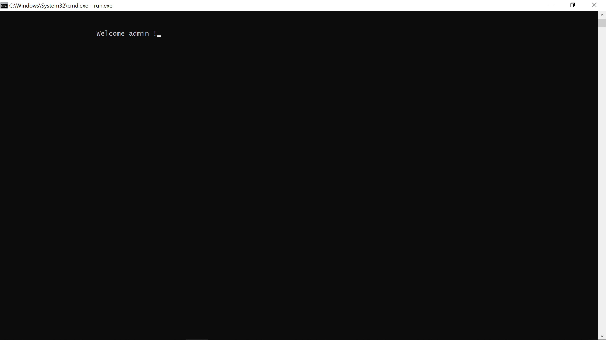
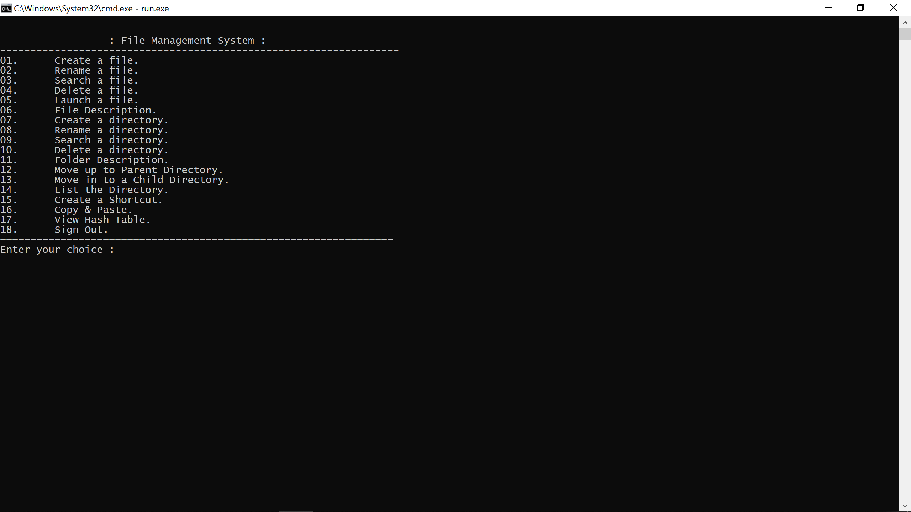
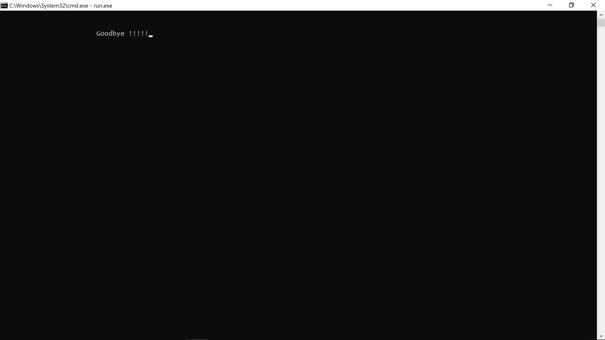

# Windows File Manager

A CLI-based C++ application that provides strong control over the common operations realted to the files & folders of the Windows operating system.
___
## Run Instructions
1. Clone the current repository.
1. open the folder created after cloning.
1. In the address-bar, type `cmd` and press `Enter`.

    
1. run the following command:
    ```bash
    >   run.exe
    ```
5. This opens the terminal application, that can be used by the user to explore the features offered in this implementation.

> It should be noted that the application creates a new folder labelled **`FMS_Root`**, and runs with this as the root directory. All commands are expected to be relative to this directory.

>It should also be noted that the application runs in the global scope of the machine, thus it will not effect the files present outside the *root*, until **EXPLICITLY** told to do so. Thus, user desgretion is advised.

&emsp;
___

## Application Screenshots






